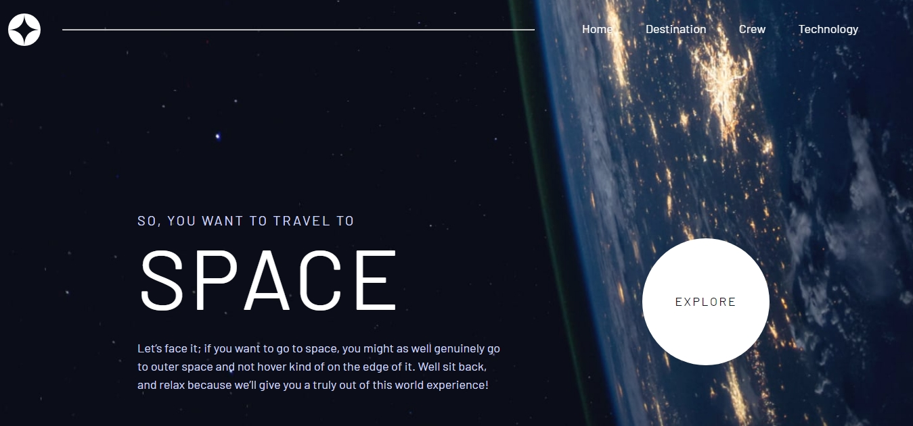

# Frontend Mentor - Space tourism website solution

This is a solution to the [Space tourism website challenge on Frontend Mentor](https://www.frontendmentor.io/challenges/space-tourism-multipage-website-gRWj1URZ3). Frontend Mentor challenges help you improve your coding skills by building realistic projects. 

## Table of contents

- [Overview](#overview)
  - [The challenge](#the-challenge)
  - [Screenshot](#screenshot)
  - [Links](#links)
- [My process](#my-process)
  - [Built with](#built-with)
  - [What I learned](#what-i-learned)
- [Author](#author)
- [Acknowledgments](#acknowledgments)

## Overview

### The challenge

Users should be able to:

- View the optimal layout for each of the website's pages depending on their device's screen size
- See hover states for all interactive elements on the page
- View each page and be able to toggle between the tabs to see new information

### Screenshot




### Links

- Solution URL: [Add solution URL here](https://github.com/dimitrisdr/space-tourism-website.git)
- Live Site URL: [Add live site URL here]( https://dimitrisdr.github.io/space-tourism-website/)

## My process

### Built with

- Semantic HTML5 markup
- CSS custom properties
- Flexbox
- CSS Grid
- Mobile-first workflow

### What I learned

```html
<h1>Some HTML code I'm proud of</h1>
```
```css
    .main--destination {
        grid-template-columns: minmax(0, 2em) minmax(0,32rem) minmax(0,28rem) minmax(0, 2em);
        grid-template-areas: '. header-d header-d .' '. img-d content-d .';
        gap: 4rem;
        align-self: center;
    }
```
```js
function changeContent(mainParent, data, dKey, category){
    let elToChange = mainParent[0].querySelectorAll(`[data-name="${dKey}"]`)

    if (!elToChange.length === 0) return
    elToChange.forEach(e=> {
        if (e.matches('img')){

            if (category !== 'tech'){
                e.setAttribute('src', 'starter-code/'+data[dKey]['png'].split('./')[1])
            } else {
                e.setAttribute('src', 'starter-code/'+data[dKey]['landscape'].split('./')[1])
            }
    
        }else if (e.matches('source')) {
    
            e.setAttribute('srcset', 'starter-code/'+data[dKey]['portrait'].split('./')[1])
    
        }else {
            e.innerText = data[dKey]
        }
    })
    
}

 async function handleSecondaryNavItems(e) {

    let btnName = e.target.dataset.name;
    let pageName = e.target.parentElement.dataset.cat;
    let allItems = Array.from(e.target.parentElement.children)

    allItems.forEach(item => item.setAttribute('aria-selected',false))
    e.target.setAttribute('aria-selected', true)
    try {

        const response = await fetch('starter-code/data.json');
        if (!response.ok){
            throw new Error('cannot get data');
        }

        const data = await response.json();
        const dataToUse = data[pageName].find(e => e['name'] === btnName);

        Object.keys(dataToUse).forEach(key => changeContent(main, dataToUse, key, pageName));
    }catch(err) {
        console.log(err);
    }
}
```

## Author

- Frontend Mentor - [@yourusername](https://www.frontendmentor.io/profile/dimitrisdr)

## Acknowledgments

I would like to personally thank Scrimba and Kevin Powell for inspiring me to complete the project. The course I attended, in particular, helped me learn many useful things that I will definitely use in the future. 
Here is the course link if someone want's to attend: [@Scrimba Space Travel](https://scrimba.com/learn/spacetravel).
